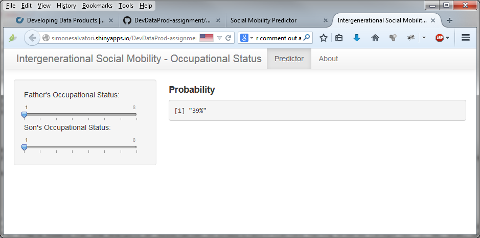

## Social Mobility Predictor

This shiny application implements a predictor of social mobility.  
More precisely, given the social status of a father's occupation (input 1) it provides the probability of a given social status (also provided as input 2) of the son's occupation.  
The Occupational Status is ranked on a scale from 1 to 8, where 1 is the highest social status and 8 the lowest.

## Data Source

The table is part of the Base R datasets, included in the standard distribution of R.  
The data are based on the cross-classification of a sample of British males according to each subject's occupational status and his father's occupational status (1949).
Data Source: Goodman, L. A. (1979) Simple Models for the Analysis of Association in Cross-Classifications having Ordered Categories. J. Am. Stat. Assoc., 74 (367), 537-552

---

## Distribution
Data show a strong correlation between the social status of the father and that of the son:
```{r, echo=T}
os1<-occupationalStatus/rowSums(occupationalStatus)
par (mfrow = c(3,4)) #used 3 rows to force proper formatting
for (i in 1:8)  {
  plot(os1[i,], xlab="son's status distr.", ylab=paste("father's status",i), type="l")}
```

---

## Predictor
The predictor allows to estimate (based on the available sample), the probability for a son to achieve e social status given the social status of his father.
Two cursors on the left are available to select the social status and the response is provided on the main panel to the right.


---

## A Valuable Tool
The use of such a tool allows for a quick estimate of the social mobility of an individual.  
The expanded application, using a larger sample, with observations over time, will clearly show the general trends in social mobility and a finer subsetting of the data will provide valuable insights for analysists and decision makers.  
  
  
Get one
---
